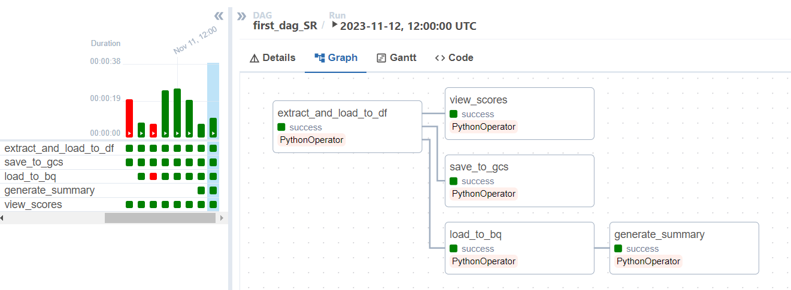
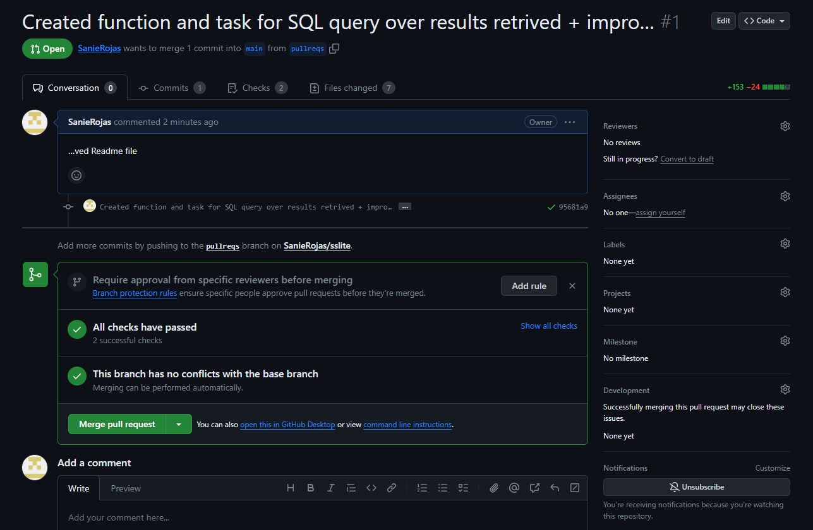
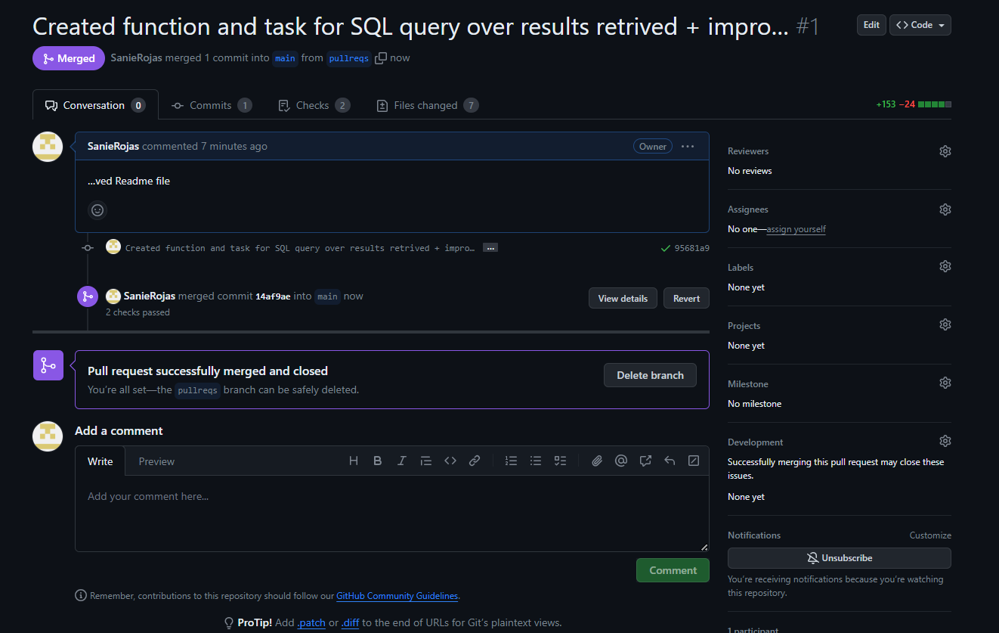

# Subject-screener 

The current project is a python based application to execute extraction, transformation and loading of internet news. 

Its potential applications are cross-disciplinary: 

- **Media Monitoring and Analysis:** monitoring brand impact providing insights into brand reputation, competitor campaings analysis, sentiment tracking, news impact and expansion, ripple-down effects, shadow-banning. 

- **Financial Analysis and Investment:** provide investment professionals with market, companies, supply chain, products, government regulation & compliance insights, sentiment analysis, extraction of potential trend predictors for further Machine Learning applications. 

- **Academic Research:** aggregate and summarize academic articles, aiding researchers in staying updated on the latest developments, build news & text corpus for further NLP processing tasks. 


## Overall Structure & Main Objective


## Requirements

Requirements for the application will be installed through the docker setup command. Libraries requested for this project are listed in a .txt file with the regular convention name -> See `requirements.txt`

Most important libraries used to achieve objective of this application: 
- `GoogleNews` : API wrapper to extract news regarding any particular subject. 
- `Pandas` : data manipulation and analysis, providing data structures like DataFrames.
- `NLTK` : Natural Language Toolkit, a comprehensive library for working with human language data, offering tools for text processing, classification, etc. 
- `Plotly` : A versatile Python library for creating interactive and visually appealing plots and dashboards.
- `Google-cloud` : Google Cloud Platform's library to leverage the suite of cloud computing services, tools and infrastructure for various applications provided by Google, including storage, computing, and machine learning.


## Setup


To execute make sure to have Docker libraries installed - if working with Windows, Docker is accesible through WSL installation. The application is built over `Python 3.8`, leveraging the pre-existing docker image of `apache/airflow:2.7.2-python3.8`. Run the following command to quickstart the image and add the required extensions. 

```
docker-compose up --build
```

For further customization make sure to review parameters listed on `docker-compose.yaml` , `Dockerfile`, `.env`. 


## External connections

The code uses a JSON extracted key file from Google Cloud Service. For further information on this topic please refer to -> https://developers.google.com/workspace/guides/create-credentials 

Key considerations to implement this connection: 

- The credentials json file must be located in the `/dags` folder. 
- The `.gitignore` file must be updated to adjust for the name of your key file. 
- The `docker-compose.yml` should be adjusted as well on parameter # GOOGLE_APPLICATION_CREDENTIALS 


## Code Overview:
The code imports various libraries and modules, including requests, pandas, os, json, re, nltk, and several Airflow-related modules, as well as the GoogleNews API. It sets up the environment variable for Google Cloud Service Account credentials.

The code defines several functions:

- `get_tokens(newsfeed)`: Cleans text by tokenizing, lowercasing, and removing stopwords.
- `get_scores(df)`: Calculates sentiment scores for news articles using the VADER sentiment analysis tool.
- `extract_entities(txt)`: Extracts named entities from a given text file.
- `setup_engine(period, subject)`: Fetches news articles using the GoogleNews API, processes the data, and saves it to a Parquet file.
- `save_to_gcs(**context)`: Uploads the Parquet file to Google Cloud Storage.
- `load_to_bq(**context)`: Appends records to a Bigquery table. 
- `generate_summary(**context)`: Calculates average daily score and records it to a BigQuery Table. 
- `view_scores(**context)`: Generates a plot displaying sentiment scores of news articles by day and saves it as an HTML file.


# Serialization and Scheduling 

To address use cases with extended retrieval requirements, an Airflow DAG is setup in `dags/dags.py`to run on a daily basis and retrieve news set up on the `variables.py` file. 

The code represents a data pipeline within an Apache Airflow DAG, which automates the process of retrieving, analyzing, storing, and visualizing news data related to a specified subject leveraging the functions described above.  

Make sure to make your changes to the `variables.py` file to customize your searches. 

## DAG Graph 


Four `PythonOperator` tasks are defined and linked together:

- `task1 (task_id: 'extract_and_load_to_df')` calls the setup_engine function to retrieve news articles, perform sentiment analysis, and save the data as a Parquet file.
- `task2 (task_id: 'save_to_gcs')` calls the save_to_gcs function to upload the Parquet file to Google Cloud Storage.
- `task3 (task_id: 'load_to_bq')` calls load_to_bq function to save the retrieved records into a BigQuery table. 
- `task4 (task_id: 'generate_summary')`calls generate_summary function to run a SQL query over the data to calculate daily score averages. 
- `task5 (task_id: 'view_scores')` calls the view_scores function to create a sentiment score plot and save it as an HTML file.

Dependency definition is setted as follows -> 

```
task1 >> (task2, task3, task5)
task3 >> task4
```


## Testing capabilities 

A `.github/workflows` folder is set up to run `tests.yml` through Github Actions each time a push/pull request is made to the repository. 
The tests stablished as per the current version are: 
- **Unitary Tests**: `get_tokens` & `get_scores` functions are the most relevant processing functions and both of them are tested to ensure a correct processing of the data has been made in all code-versions. 

When a push/pull request is submited, such tests are run to ensure new versions comply with overall processing objectives. See below the example of a successfull pull request notification in GitHub. 



To merge changes from successfull pull requests make sure to execute the "Merge pull request" option through the Github UI or through command line, assuming your PR branch is called `pullreqs` by running the following commands: 

```
git checkout main
git merge pullreqs
```





## Storing & Analyses

To accumulate and further analyze the data, the BigQuery offering of Google Cloud Platform was selected due to its ease of use and capabilities to handle relational databases with SQL statements. 
For further details on this product refer to -> https://cloud.google.com/bigquery/?hl=en 

Table News-by-subject stores all news headlines retrieved by the Api, along with tokens and scores generated by our processing functions. 
Replace the  `project_id`, `dataset_id` parameters on the SQL statement below to create tables on your BigQuery database. 

```
CREATE TABLE `project_id.dataset_id.news-by-subject` (
  title STRING,				
  date STRING,					
  datetime DATETIME,					
  subject STRING,					
  tokens STRING,					
  score FLOAT
);
```

Table Subject_scorest stores average daily scores by subject.  
Replace the  `project_id`, `dataset_id` parameters on the SQL statement below to create tables on your BigQuery database.

```
CREATE TABLE `project_id.dataset_id.subject_scorest` (
  subject STRING,
  avg_score FLOAT64,
  change_date DATE
);
```